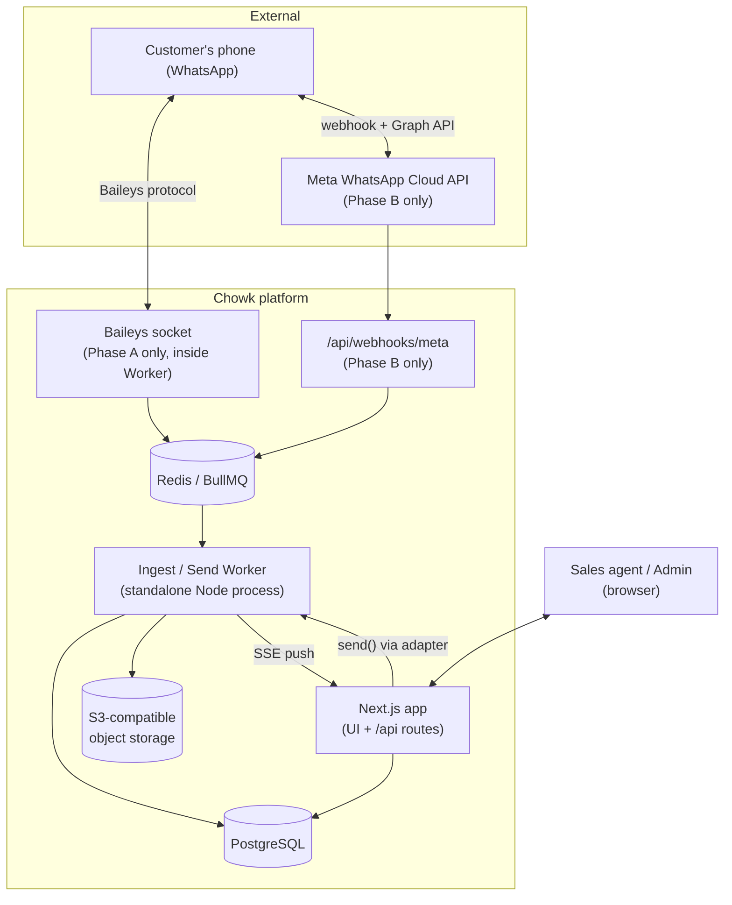
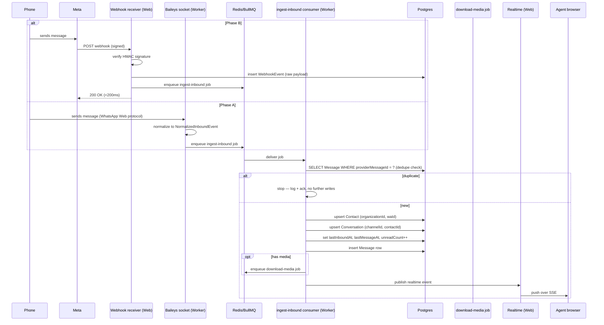
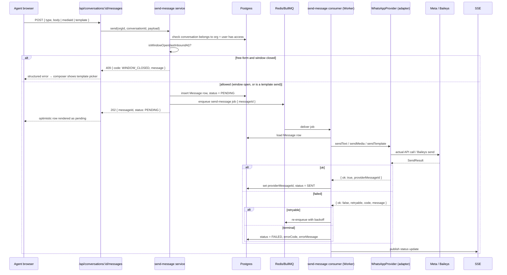
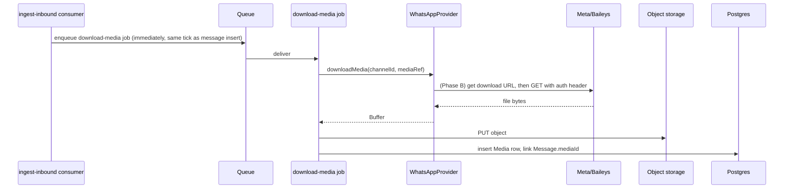
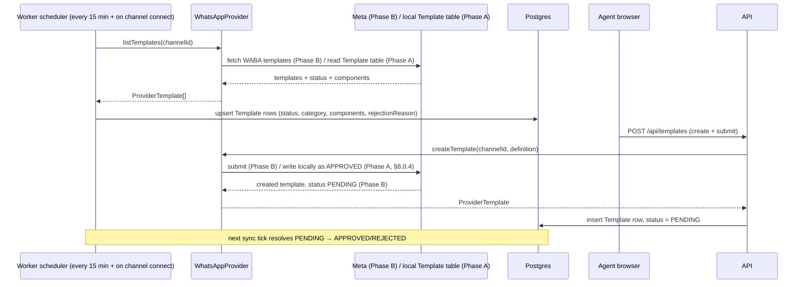
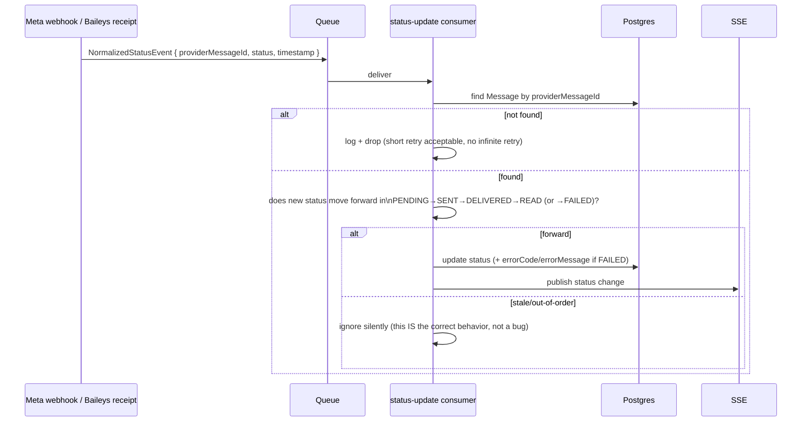
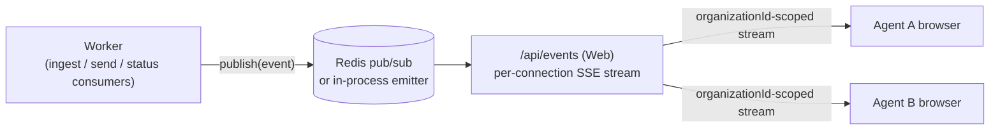
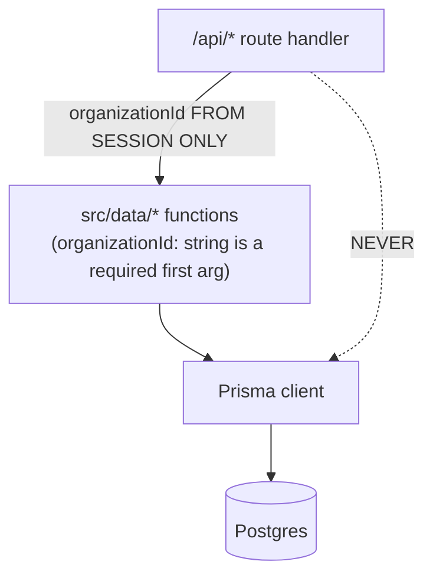
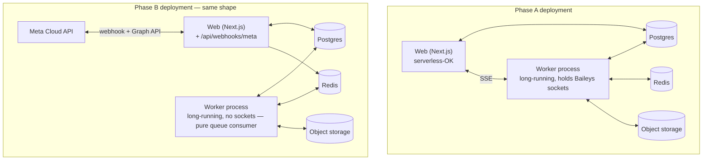

# architecture.md — Chowk system architecture (Tier 1)

> Companion to `context.md`. That file defines *what* to build and *why*; this file defines *how the pieces fit together* — processes, modules, data flow, and failure handling — at a level of detail concrete enough to start scaffolding directories and interfaces from. If anything here conflicts with `context.md`, `context.md` wins; file an issue in `TODO-VERIFY.md` rather than silently reconciling.

---

## 1. Goals of this document

- Give every process/module a name, a responsibility, and a boundary.
- Make the provider-adapter boundary (context.md §8.0, rule 0) mechanically enforceable, not just a convention.
- Trace each of the product's core operations (inbound message, outbound send, media, template sync, status update, realtime push) as a concrete sequence across components.
- Fix the deployment topology so Phase A and Phase B are provably the same shape with one swapped component.
- Name the failure modes and the specific mechanism that closes each one (dedupe key, forward-only status, idempotent upsert, etc.) — see context.md §12, §4.5, §4.7.

This is not a task list. Build order is still Section 11 of `context.md`.

---

## 2. System context



Two actors sit outside our trust boundary: the customer's phone (never trusted, always the far end of a WhatsApp conversation) and Meta (trusted but versioned — see context.md §0 rule 1). Everything inside `chowk` is ours to control and is where tenancy, idempotency, and the provider boundary get enforced.

---

## 3. Process topology

Four independent runtime units, deployed separately, communicating only through Postgres, Redis, and HTTP/SSE — never through in-memory shared state or direct function calls across the process boundary.

| Process | Runtime | Long-running? | Owns |
|---|---|---|---|
| **Web** | Next.js (App Router), serverless-compatible | No | UI rendering, `/api/*` route handlers, SSE endpoint, session/auth |
| **Worker** | Standalone Node process | **Yes — mandatory** | BullMQ consumers, Baileys socket (Phase A), scheduled jobs (template sync), all outbound-send execution |
| **Webhook receiver** | Same Next.js deployment as Web, or split out | No (must be fast) | `POST/GET /api/webhooks/meta` — Phase B only, always thin |
| **Postgres / Redis / Object store** | Managed services | Yes | State |

**Why Web cannot own sends or sockets:** Next.js API routes may run on a serverless platform with no guarantee of process continuity between requests. A Baileys socket needs a persistent TCP connection; a send needs to survive the HTTP request that triggered it. Both live in Worker. Web's job on a send is: validate, write a `PENDING` row, enqueue a job, return. Worker does the actual `provider.sendText()` call. (context.md §5, "Two processes, deliberately.")

**Why the webhook receiver must be fast and separate in spirit even if same deployment:** Meta retries on slow or non-200 responses, and retries duplicate work. The receiver's only job is signature verification + `WebhookEvent` insert + enqueue. No DB upserts, no Meta API calls, no media fetches happen inline in the receiver. (context.md §4.5, §8.1)

---

## 4. Repository layout

```
src/
  app/                          # Next.js App Router — pages + layouts only
    (dashboard)/...
    login/...
  api/                          # Route handlers — thin, delegate to services/
    conversations/
    contacts/
    templates/
    quick-replies/
    channels/
    users/
    tags/
    events/route.ts             # SSE
    webhooks/meta/route.ts       # Phase B receiver — signature verify + enqueue only

  providers/                    # THE ONLY PLACE THAT MAY KNOW ABOUT TRANSPORTS
    types.ts                    # WhatsAppProvider interface, NormalizedInboundEvent, etc.
    factory.ts                  # reads WHATSAPP_PROVIDER, returns a WhatsAppProvider
    baileys/
      adapter.ts                # implements WhatsAppProvider
      session-store.ts          # persists Baileys creds to DB/object storage
      simulate-window.ts        # 24h window check (context.md §8.0.4)
      simulate-templates.ts     # local Template table as fake Meta templates
      simulate-rate-limit.ts    # self-imposed send throttle
    cloud-api/
      adapter.ts                # implements WhatsAppProvider
      webhook-verify.ts         # HMAC signature check
      error-map.ts              # Meta error code → retryable | terminal

  services/                     # Transport-agnostic business logic. No provider imports.
    conversations/
    contacts/
    templates/
    messages/
      send-message.ts           # window check → PENDING row → enqueue send job
      ingest-message.ts         # dedupe → upsert contact/conversation → persist → realtime
    media/
      download-and-store.ts
      upload-outbound.ts
    window.ts                   # isWindowOpen() — the ONE place this is computed
    realtime/
      publish.ts                # fan-out to SSE connections

  data/                         # Data-access layer. Every function requires organizationId.
    organizations.ts
    users.ts
    channels.ts
    contacts.ts
    conversations.ts
    messages.ts
    templates.ts

  queue/
    connection.ts                # Redis connection
    queues.ts                    # queue name constants + typed job payloads
    jobs/
      ingest-inbound.job.ts
      download-media.job.ts
      send-message.job.ts
      sync-templates.job.ts

  worker/
    index.ts                     # process entrypoint — starts all consumers + Baileys sockets
    consumers/
      ingest-inbound.consumer.ts
      download-media.consumer.ts
      send-message.consumer.ts
    scheduler.ts                  # cron-style: template sync every 15 min

  config/
    branding.ts                  # PRODUCT_NAME = "Chowk" — the only place the name lives
    env.ts                        # validated env (Zod), incl. WHATSAPP_PROVIDER

  lib/
    auth/
    logging/                      # structured JSON logger, correlation-id middleware
    validation/                   # shared Zod schemas

prisma/
  schema.prisma

.eslintrc.*                      # no-restricted-imports rule, see §5
TODO-VERIFY.md                   # uncertain Meta API details, flagged not guessed
PROGRESS.md
```

Rule of thumb for where new code goes: if it needs to know whether the transport is Baileys or Cloud API, it belongs under `src/providers/`. Everything else — routes, services, data access, worker consumers, UI — is transport-agnostic and operates only on `NormalizedInboundEvent`, `NormalizedStatusEvent`, and the `WhatsAppProvider` interface.

---

## 5. Enforcing the provider boundary mechanically

Convention alone will not hold six weeks in (context.md §8.0.5 says this explicitly). Three concrete backstops:

1. **ESLint `no-restricted-imports`** (added at M2): forbid importing anything from `src/providers/baileys/**` or the `baileys` package from any file outside `src/providers/baileys/`. Same rule shape for `cloud-api` internals if it ever grows provider-SDK specifics.
2. **One factory, one call site.** `src/providers/factory.ts` is the only place `WHATSAPP_PROVIDER` is read. It returns a `WhatsAppProvider`. `worker/index.ts` and any service needing to send call the factory-provided singleton — never `new BaileysAdapter()` directly.
3. **Type-level narrowing is disallowed.** No code outside `providers/` may inspect `provider.name`. If a service needs different behavior per transport, that's a sign the interface (context.md §8.0.1) is missing a method — fix the interface, don't branch around it.

The M2 "done" criterion in context.md — *a stub `cloud-api` provider compiles and is selectable by env var without touching code outside `src/providers/`* — is the acceptance test for this boundary. If it fails, stop and fix the abstraction before continuing (context.md §11, M2 note).

---

## 6. Data flow: inbound message

Both phases converge on the identical path from the queue onward. Only the left edge differs.



Key invariants enforced at the `IC` (ingest-inbound consumer) step, transport-agnostic:

- **Dedupe on `providerMessageId`, scoped by `provider`** (context.md §8.0.2) — a Phase A id and a Phase B id never collide because they're different namespaces even if the string happened to match.
- **Upserts, not inserts**, for Contact and Conversation — repeat delivery of the same event must be a no-op past the dedupe check, and first-contact-ever must not race a duplicate insert.
- **`UNSUPPORTED` fallback** — if `type` doesn't map to our `MessageType` enum, store `UNSUPPORTED` with `raw` preserved and continue. Never throw out of this consumer (context.md §7.4).

---

## 7. Data flow: outbound send



Why the `Message` row is written **before** the provider call (context.md §8.2, step 3): if the Worker process dies mid-send, the row exists as `PENDING` rather than the send vanishing with no trace. A reconciliation job (M9 hardening) can find stuck `PENDING` rows past a timeout and re-check or re-send.

The window check happens **server-side, in `Svc`, before enqueueing** — never trust the client, and never let a client-side stale window state cause a send that Meta will reject (context.md §8.2, step 2; §10.4).

---

## 8. Data flow: media

**Inbound** (context.md §8.3, §4.4):



The download-media job is enqueued in the **same transaction tick** as the message insert, not on-demand when an agent opens the chat — Meta's media URLs are short-lived (context.md §4.4, §8.3) and a lazy fetch risks permanent loss.

**Outbound**: `uploadMedia()` is called first (adapter uploads to Meta, gets a media ID), then `sendMedia()` references that ID. We keep our own object-storage copy regardless, so the thread still renders after Meta's retention window lapses (context.md §8.3).

---

## 9. Data flow: templates



Meta is the source of truth for template status (context.md §4.2). We never assume our local copy is current between syncs, and **at send time** — not just at selection time in the picker — we re-check `status === 'APPROVED'` before calling `sendTemplate()` (context.md §8.4).

---

## 10. Data flow: status updates (delivery receipts)



This is one of the four places context.md §13 names as where correctness bugs hide — status progression must be unit-tested directly against the enum ordering, independent of any live webhook.

---

## 11. Realtime delivery



- The SSE endpoint (`/api/events`) subscribes to a Redis pub/sub channel keyed by `organizationId` (or fans out and filters — either works at Tier 1 scale; keying by org avoids shipping cross-tenant events to the transport layer at all, which is the safer default).
- Reconnect strategy: client-side `EventSource` auto-reconnects; server assigns each connection a last-seen cursor so a brief drop doesn't lose events — on reconnect, the client also re-fetches the conversation list/thread to reconcile, since SSE is a convenience channel, not the source of truth.
- Fallback to polling if SSE fails to establish (context.md §10.7).

---

## 12. Tenancy enforcement architecture



`organizationId` never travels through a route parameter, query string, or request body — it is read once from the authenticated session at the top of the route handler and passed down. Every function in `src/data/` takes it as a required, non-optional first argument, so a call site that "forgets" it is a type error, not a silent bug. Enforced further by the cross-tenant integration tests in context.md §7.6/§13 — write a test that logs in as org A, requests org B's conversation by guessed ID, and asserts an empty/404 result.

---

## 13. Queue and job design

| Queue | Producer | Consumer | Payload | Notes |
|---|---|---|---|---|
| `ingest-inbound` | Webhook receiver (B) / Baileys socket (A) | Worker | `NormalizedInboundEvent` | Idempotent — safe to redeliver |
| `download-media` | ingest-inbound consumer | Worker | `{ messageId, mediaRef, channelId }` | Time-sensitive (§8), retried aggressively before URL expiry (Phase B) |
| `send-message` | send-message service | Worker | `{ messageId }` | Loads full state from DB by id — never carries the payload itself, so retries always read current DB state |
| `status-update` | Webhook receiver (B) / Baileys receipts (A) | Worker | `NormalizedStatusEvent` | Forward-only apply, see §10 |
| `sync-templates` | Scheduler (cron, every 15 min) + on channel connect | Worker | `{ channelId }` | Idempotent upsert |

General rules across all queues:
- Jobs carry **references** (ids), not full payloads, wherever the referenced row already exists — this way a retried job always re-reads current DB state instead of replaying possibly-stale data.
- BullMQ retry policy: exponential backoff for anything the adapter marks `retryable`; terminal failures write `FAILED` and do not retry (context.md §4.7).
- The worker must recover cleanly from a forced restart mid-queue (context.md §11, M9 "done" criterion) — this falls out naturally from jobs being idempotent and DB-state-driven rather than in-memory.

---

## 14. Deployment topology



The two deployments are structurally identical: same Web, same Worker, same Postgres/Redis/S3. Phase B adds an inbound HTTP path (the webhook) and removes the Baileys socket from Worker; nothing about how Worker talks to Postgres, Redis, or the object store changes. This is the concrete proof, at the deployment-diagram level, of the claim in context.md §5 that "Phase B is a swap rather than a rewrite."

**Non-negotiable:** Worker is never deployed to a serverless platform in either phase — a Baileys socket cannot survive being torn down between invocations, and even in Phase B, queue consumers benefit from not cold-starting per job (context.md §6, deployment note).

---

## 15. Security architecture

- **Webhook signature verification** (Phase B): raw request body read before JSON parsing, HMAC-SHA256 verified against the app secret, reject with 401 on mismatch, before any DB write (context.md §4.5, §8.1).
- **Secrets**: `Channel.accessTokenRef` is a lookup key into an environment-based secret store, never the token itself, never in Postgres, never in application code (context.md §7.2, §12).
- **Session-derived tenancy**: see §12 above — `organizationId` only ever comes from the authenticated session.
- **No message bodies in logs** (context.md §12) — the structured logger must redact or omit `Message.body` and any media content; log message *ids* and *metadata* (status, error code, timestamps), not content.
- **Baileys session credentials**: persisted to DB/object storage keyed by channel, never to local disk (context.md §8.1b) — local disk does not survive a redeploy and would silently orphan a channel's session.

---

## 16. Observability

- Structured JSON logs, every entry carrying `organizationId` and a correlation id that threads from the inbound webhook/socket event (or the originating API request) through every queue hop to the final DB write or SSE publish. This is what makes a single message traceable across the webhook receiver → queue → worker → DB → realtime path when something goes wrong.
- `WebhookEvent` table (context.md §7.5) is the raw-payload black box — retained 30 days, queried directly when production behavior is inexplicable. It is not a log; it is evidence of exactly what Meta sent.
- Worker emits explicit metrics/log lines on: dedupe hits (duplicate `providerMessageId`), stale status updates ignored, retryable vs terminal send failures, media download failures past retry budget.

---

## 17. Failure modes and their mechanism

| Failure | Mechanism that prevents/contains it |
|---|---|
| Duplicate inbound message (Meta retry, Baileys history-sync replay) | Dedupe on `(provider, providerMessageId)` unique constraint before any write (context.md §7.4, §8.1, §8.1b) |
| Out-of-order status webhook downgrading a message | Forward-only status progression check (context.md §7.4, §10) |
| Crash mid-send losing a message silently | `PENDING` row written before the provider call; crash leaves a recoverable row, not nothing (context.md §8.2) |
| Media URL expiring before we fetch it | Download job enqueued immediately on ingest, not lazily on chat-open (context.md §4.4, §8.3) |
| Unknown Meta message type crashing ingest | `UNSUPPORTED` type + raw payload preserved, pipeline continues (context.md §7.4) |
| Agent typing a message that can't be delivered | Server-side window check before enqueue, composer UI reflects window state before typing even starts (context.md §8.2, §10.4) |
| Cross-tenant data leak | `organizationId` required at the data-access layer, never taken from request params; tested directly (context.md §7.6) |
| Webhook flooding from an unverified caller | Signature check before any DB write, 401 on mismatch (context.md §4.5, §8.1) |
| Worker restart losing in-flight jobs | Jobs are DB-state-driven and idempotent by id, not payload-carrying (see §13) |
| Baileys number ban risk from high volume | Self-imposed send throttle in the Baileys adapter (context.md §8.0.4) |

---

## 18. What this document deliberately does not cover

- Exact Meta endpoint paths, field names, and error codes — those are verified against live documentation at implementation time per context.md §0 rule 1, and isolated behind `src/providers/cloud-api/` so a wrong guess is a one-file fix.
- UI component breakdown — see context.md §10 for the product-level spec; component-level React structure is an implementation detail decided during M3–M8.
- Anything listed in context.md §2.2 (out of scope). If a diagram here seems to imply one of those, that's a drafting error — flag it rather than build toward it.
